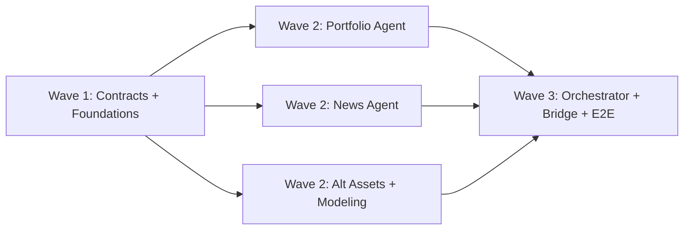

# Phase 2: Agent Pipeline -- Overview

**Goal:** Triggering a report request produces a complete unified narrative markdown document synthesized from all five agents -- verifiable via curl with no frontend running.

**Plans:** 5 plans across 3 waves (9 tasks total)
**Requirements covered:** 25/25

---

## Key Deliverables

1. **Expanded model contracts** -- PortfolioResponse gains correlation matrix, AlternativesResponse gains trend signals / BTC dominance / commodities, new ReportRequest model for bridge-to-orchestrator communication
2. **Central mock portfolio** -- 12 holdings across 6 sectors (49% tech, BTC+ETH at 14%) shared by all agents
3. **Four live domain agents** -- Portfolio (computation), News (Finnhub + FinBERT), Alternatives (CoinGecko + Finnhub commodities), Modeling (enhanced mock with real base64 chart)
4. **Orchestrator with LLM synthesis** -- Concurrent fan-out to all agents, cross-agent contradiction detection, GPT-4o mini unified narrative generation
5. **Bridge /report endpoint** -- POST triggers orchestrator, report delivered via SSE `report.complete` event

---

## Wave Breakdown



### Wave 1 -- Contracts and Foundations

| Plan | Objective | Tasks | Key Files |
|------|-----------|-------|-----------|
| 02-01 | Model contract updates, dependency additions, central mock portfolio, mock chart generation | 2 | `responses.py`, `requests.py`, `data/portfolio.py`, `mocks/*` |

Establishes the shared data contracts and mock data that all downstream agents depend on. Adds `yfinance`, `transformers`, `openai` to dependencies. Generates a real base64 PNG chart for the modeling mock.

### Wave 2 -- Domain Agents (parallel)

| Plan | Objective | Tasks | Key Files |
|------|-----------|-------|-----------|
| 02-02 | Portfolio agent live computation -- sector allocation, Herfindahl index, beta, correlation matrix | 1 | `portfolio_agent.py`, `tests/test_portfolio.py` |
| 02-03 | News agent -- Finnhub headline fetching, FinBERT sentiment scoring, per-ticker aggregation | 1 | `news_agent.py`, `tests/test_news.py` |
| 02-04 | Alt Assets agent (CoinGecko crypto + Finnhub commodities + cross-correlations) and Modeling mock enhancement | 2 | `alternatives_agent.py`, `modeling_agent.py`, `tests/test_alternatives.py` |

Three independent vertical slices executing in parallel. Each agent follows the same pattern: fetch data, compute metrics, emit 3-5 thought events with personality-appropriate teasers, return structured response.

**Agent personalities:**
- Portfolio -- precise, metrics-focused
- News -- headline-style, punchy
- Alternatives -- market-savvy, crypto-native
- Modeling -- stays mock (teammate handles real implementation)

### Wave 3 -- Orchestrator and Integration

| Plan | Objective | Tasks | Key Files |
|------|-----------|-------|-----------|
| 02-05 | Orchestrator fan-out, contradiction detection, GPT-4o mini synthesis, bridge /report endpoint, E2E verification | 3 | `orchestrator.py`, `bridge/app.py`, `tests/test_orchestrator.py` |

Wires everything together. The orchestrator dispatches to all four agents via `asyncio.gather`, detects cross-agent contradictions (bearish sentiment on top holdings, positive news with negative momentum), then sends all data to GPT-4o mini with instructions to produce a unified thematic narrative in professional analyst tone. The bridge `/report` POST endpoint triggers the pipeline and delivers the final markdown via SSE.

**This plan is NOT autonomous** -- includes a human verification checkpoint for the full E2E curl test.

---

## Requirement Coverage Map

| Category | IDs | Plan |
|----------|-----|------|
| Portfolio | PORT-01 | 02-01 (mock data) |
| Portfolio | PORT-02, PORT-03, PORT-04, PORT-05 | 02-02 (computation) |
| News | NEWS-01 through NEWS-05 | 02-03 |
| Modeling | MODL-03 | 02-01 (mock chart) |
| Modeling | MODL-01, MODL-02, MODL-04, MODL-05 | 02-04 (mock enhancement) |
| Alternatives | ALT-01 through ALT-04 | 02-04 |
| Orchestrator | ORCH-01 through ORCH-05 | 02-05 |

---

## Critical Data Flow

```
Bridge POST /report
    |
    v
Orchestrator on_rest_post
    |
    +-- asyncio.gather -------------------------+
    |       |          |            |            |
    v       v          v            v            |
Portfolio  News    Alternatives  Modeling        |
  agent    agent     agent       agent (mock)    |
    |       |          |            |            |
    v       v          v            v            |
PortfolioResponse  NewsResponse  AlternativesResponse  ModelResponse
    |       |          |            |
    +-------+----------+------------+
    |
    v
detect_contradictions()
    |
    v
build_synthesis_prompt() --> GPT-4o mini
    |
    v
Unified markdown narrative
    |
    v
SSE push: report.complete
```

---

## Success Criteria

1. `curl -X POST http://localhost:8000/report` triggers the full pipeline
2. `curl -N http://localhost:8000/events` stream shows `report.complete` with:
   - Portfolio metrics (sector allocation, HHI, beta, correlation matrix)
   - News sentiment (per-ticker and aggregate)
   - At least one embedded base64 chart
   - Crypto/commodity data with trend signals
   - Synthesized executive summary in professional analyst tone
   - Thematic sections (not per-agent sections)
