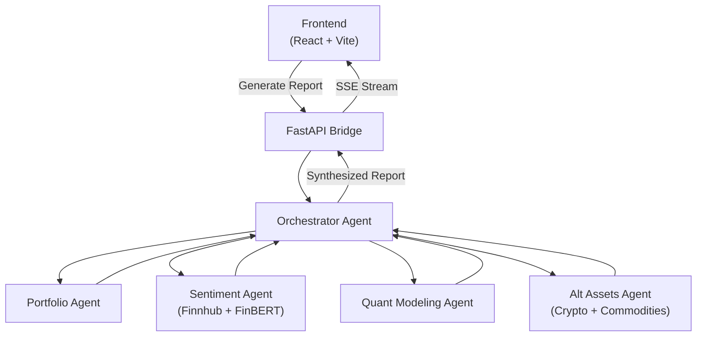

# Wealth Council

**A multi-agent investment intelligence platform that turns your portfolio into a single, unified report -- with plain-language explanations anyone can follow and quantitative depth that experienced investors actually want.**

---

## The Problem

Over 30 million new brokerage accounts were opened between 2020 and 2022. Opening an account has never been easier -- but understanding what's in it hasn't gotten any simpler.

Institutional investors have tools like Bloomberg ($32k/year) and Refinitiv ($113k/year) that synthesize news sentiment, quantitative modeling, correlation analysis, and risk metrics into a single view. Everyone else is left manually cross-referencing fragmented sources across a dozen open tabs, connecting dots by hand, and guessing at how the pieces fit together.

Wealth Council closes that gap. One button generates a comprehensive investment report that combines portfolio analysis, quantitative modeling, news sentiment, and alternative asset data -- explained clearly enough for a college student and detailed enough for a quant.

---

## Who This Is For

**The Curious Student** -- You're new to investing and want to understand what's happening in the markets without needing a finance degree. Wealth Council explains metrics like Sharpe ratio and portfolio beta in plain language so you can learn while you review.

**The Self-Directed Investor** -- You manage your own brokerage account and check it daily, but you're reading news in one place, checking prices in another, and mentally synthesizing across them. Wealth Council gives you a unified view of what matters specifically to your holdings.

**The Quantitative Enthusiast** -- You want correlation matrices, sector exposure breakdowns, and volatility charts alongside the news -- not instead of it. Wealth Council gives you the data and lets you draw your own conclusions.

---

## What It Does

Wealth Council runs a pipeline of specialized agents that each handle a different dimension of analysis, then synthesizes their outputs into a single cohesive report.

### Portfolio Analysis
Computes sector allocation, portfolio beta against the S&P 500 benchmark, concentration risk (HHI), and a 90-day correlation matrix across your equity holdings.

### Quantitative Modeling
Calculates risk-adjusted return metrics (Sharpe ratio, annualized volatility) and generates performance charts -- sector breakdowns, correlation heatmaps, and volatility profiles.

### News Sentiment
Fetches financial news headlines, filters for relevance to your specific holdings, and scores sentiment using FinBERT (a financial domain NLP model). The report surfaces what the market is saying about the stocks you actually own.

### Alternative Assets
Pulls crypto and commodity market data (gold, oil, top crypto assets) and computes cross-correlations with your equity portfolio -- so you can see how alternative markets relate to your holdings.

### Unified Synthesis
An orchestrator agent collects all of the above, detects contradictions (e.g., bullish news sentiment but bearish crypto momentum), and uses an LLM to weave everything into a single narrative report rather than disconnected data sections.

---

## How It Works



The frontend displays an interactive agent graph showing the pipeline. Press "Generate Report" and watch the agents work -- their outputs stream back in real time via Server-Sent Events and assemble into the final report.

---

## Roadmap

| Version | Status | Scope |
| :------ | :----- | :---- |
| **V0** -- Basic Infrastructure | Complete | Mock data, template-based report, 3 agents (Portfolio, Modeling, Orchestrator), React frontend with agent graph |
| **V1** -- Working Implementation | Complete | Live API data (Finnhub, CoinGecko, yfinance), LLM synthesis via Gemini, News and Alt Assets agents, FinBERT sentiment scoring |
| **V2** -- MVP | Planned | User authentication, brokerage API integrations (Alpaca, Schwab, Robinhood), adaptive report complexity, report history and comparison, scheduled reports |

---

## Running Locally

The project has two parts: the agent pipeline (Python backend) and the frontend (React).

### Prerequisites
- Python 3.11+
- Node.js 18+
- [uv](https://docs.astral.sh/uv/) (Python package manager)

### 1. Start the Backend

```bash
cd agents
uv pip install -e .
cp .env.example .env
python -m agents.bridge.app
```

`MOCK_DATA=true` is enabled by default in `.env`, so the entire pipeline runs offline without any API keys. To use live data, add your [Finnhub](https://finnhub.io/dashboard) and [Gemini](https://aistudio.google.com/apikey) keys to `.env` and set `MOCK_DATA=false`.

The backend runs on `http://localhost:8000`.

### 2. Start the Frontend

In a separate terminal:

```bash
cd frontend
npm install
npm run dev
```

The frontend runs on `http://localhost:5173`.

### Running Tests

```bash
cd agents
pytest
```

61 unit tests cover the full agent pipeline. All external API calls and ML models are monkeypatched, so tests run in seconds with no external dependencies.

---

## Tech Stack

| Layer | Tools |
| :---- | :---- |
| Frontend | React, TypeScript, Vite, SSE for real-time streaming |
| Agent Framework | Fetch.ai uAgents |
| API Bridge | FastAPI + SSE-Starlette |
| LLM | Google Gemini (report synthesis) |
| NLP | HuggingFace Transformers + FinBERT (sentiment scoring) |
| Data & Modeling | pandas, NumPy, yfinance, matplotlib |
| Testing | pytest (61 tests, monkeypatched isolation) |

---

## License

See [LICENSE](LICENSE) for details.
