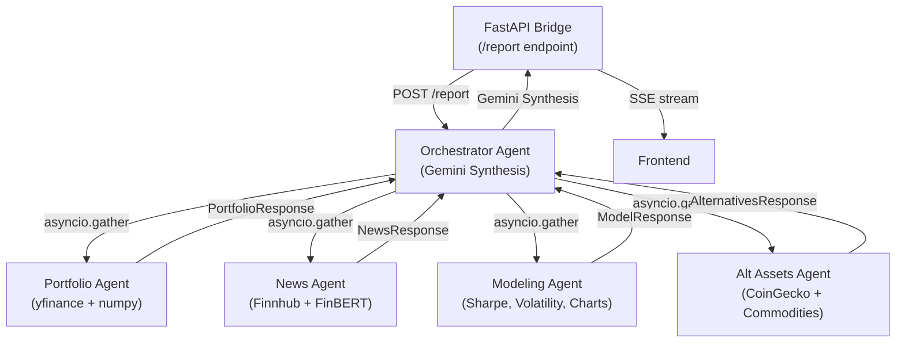

# InvestorSwarm 🧠📈

**A multi-agent investment intelligence platform that synthesizes complex financial signals into actionable narratives.**

InvestorSwarm uses a decentralized swarm of specialized AI and data computation agents to analyze your portfolio. Instead of just querying an LLM with market data, our platform splits the analytical workload across dedicated "domain expert" agents (Portfolio, Sentiment, Modeling, and Alt Assets). An Orchestrator agent then synthesizes their findings, detects contradictions, and delivers a unified, executive-grade investment report.


---

## 🏗️ Architecture Overview

The system runs on the **Fetch.ai `uAgents` framework**, leveraging a multi-agent system (MAS) where agents live in a single Bureau process but communicate asynchronously via structured Pydantic messages.



---

## 🤖 The Swarm (Agent Pipeline)

Our system consists of 5 core agents. Four are pure computational/data nodes (fetching APIs, running mathematical models, scoring NLP), and one is the LLM-powered brain.

### 1. Orchestrator Agent (The Brain)
- **Role:** The conductor of the swarm.
- **Functionality:** Dispatches concurrent requests (`asyncio.gather`) to all 4 domain agents. It collects the structured numerical and text data, runs contradiction detection (e.g., flagging when sentiment is bullish but crypto momentum is bearish), and uses **Google Gemini** to synthesize a cohesive narrative report.

### 2. Portfolio Agent (Risk & Allocation)
- **Role:** Pure mathematical computation node.
- **Functionality:** Downloads live historical ticker prices using `yfinance`. Computes sector allocation, portfolio beta against the SPY benchmark, the Herfindahl-Hirschman Index (HHI) for concentration risk, and a 90-day correlation matrix across equities using `numpy` and `pandas`.

### 3. Sentiment Engine (News & NLP)
- **Role:** Market perception and NLP scoring.
- **Functionality:** Fetches live general market and company-specific news via `Finnhub`. Uses a lazy-loaded **FinBERT** `transformers` machine learning pipeline to score the sentiment of deduplicated headlines (from -1 to 1). Discards noisy/neutral headlines and aggregates mean sentiment per ticker.

### 4. Quant Modeler (Performance Analytics)
- **Role:** Technical performance evaluation.
- **Functionality:** Calculates risk-adjusted return metrics like the Sharpe Ratio and annualized volatility. It also generates and serves rich `matplotlib` base64 performance charts directly to the frontend.

### 5. Alt Assets Agent (Crypto & Commodities)
- **Role:** Macro and alternative market signals.
- **Functionality:** Makes concurrent API calls to `CoinGecko` for top crypto asset prices, 7-day changes, and BTC dominance, while hitting `Finnhub` for Gold and Oil commodity prices. Runs Pearson cross-correlation between crypto assets and the core equity portfolio.

---

## 🛠️ Tech Stack

**Frontend:**
- React + TypeScript + Vite
- CSS3 (Vanilla + Custom Animations)
- Lucide React (Icons)
- Server-Sent Events (SSE) for real-time agent thought streaming

**Backend (Python):**
- **uAgents (Fetch.ai):** Multi-agent protocol & Bureau hosting
- **FastAPI + SSE-Starlette:** Asynchronous bridge connecting UI to the agent swarm
- **Google GenAI (Gemini):** LLM integration for narrative synthesis
- **Transformers (Hugging Face) + Torch:** FinBERT pipeline for NLP sentiment analysis
- **Pandas + NumPy + yfinance:** Financial modeling and data fetching
- **Pytest:** 60+ unit tests covering monkeypatched API calls and pure math functions

---

## 🚀 Getting Started

The project is split into the `frontend` and the `agents` (backend pipeline).

### 1. Start the Agent Pipeline
```bash
cd agents
uv pip install -e .
```
Copy the environment variables:
```bash
cp .env.example .env
```
*(Note: `MOCK_DATA=true` is enabled by default in `.env` so you can run the entire pipeline offline without any API keys!)*

Start the FastAPI bridge and the uAgents Bureau:
```bash
python -m agents.bridge.app
```
*The backend will run on `http://localhost:8000`.*

### 2. Start the Frontend
In a new terminal:
```bash
cd frontend
npm install
npm run dev
```
*The frontend will run on `http://localhost:5173`. Open this in your browser to view the interactive Swarm Graph and trigger reports!*

---

## 🧪 Testing

We have achieved robust coverage with **61 unit tests** spanning the entire agent pipeline. Tests are strictly isolated (all external API calls and HuggingFace models are monkeypatched) ensuring they run in seconds without external dependencies.

```bash
cd agents
pytest
```
