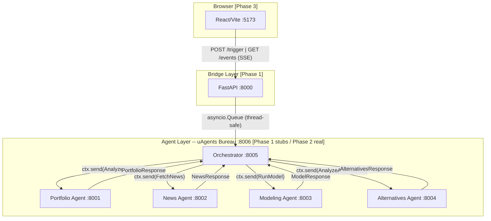
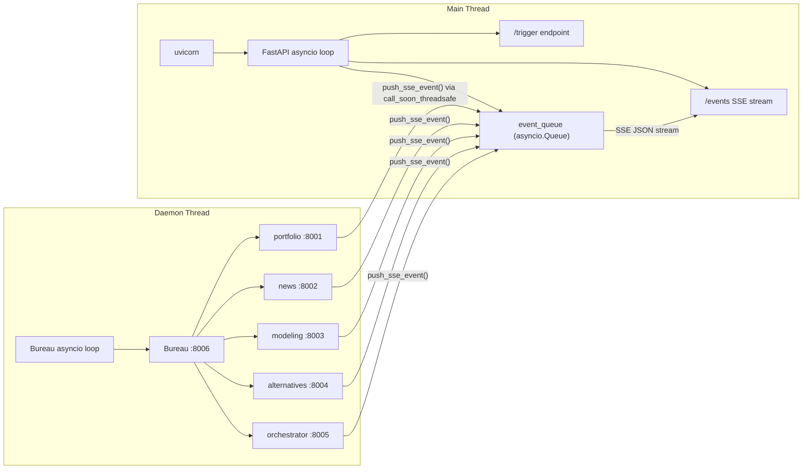
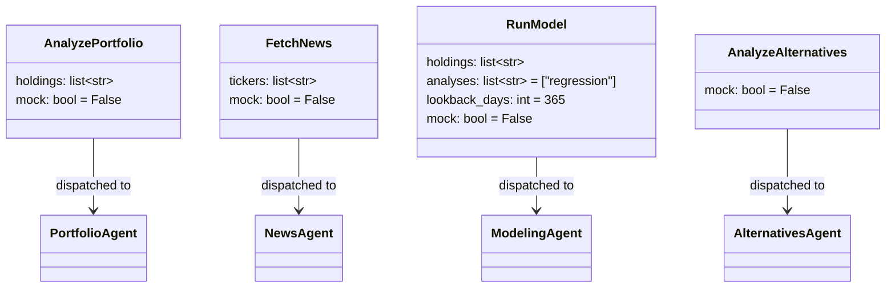
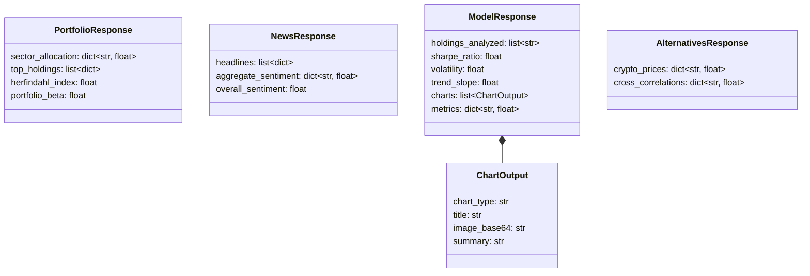
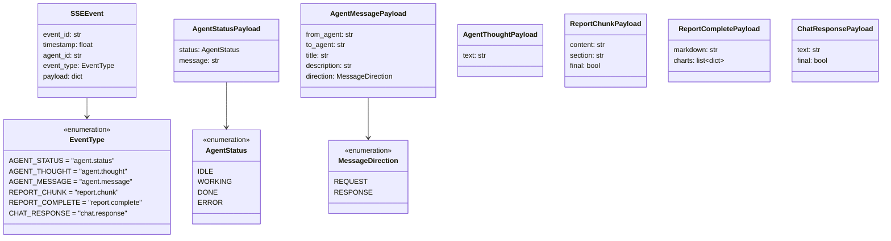
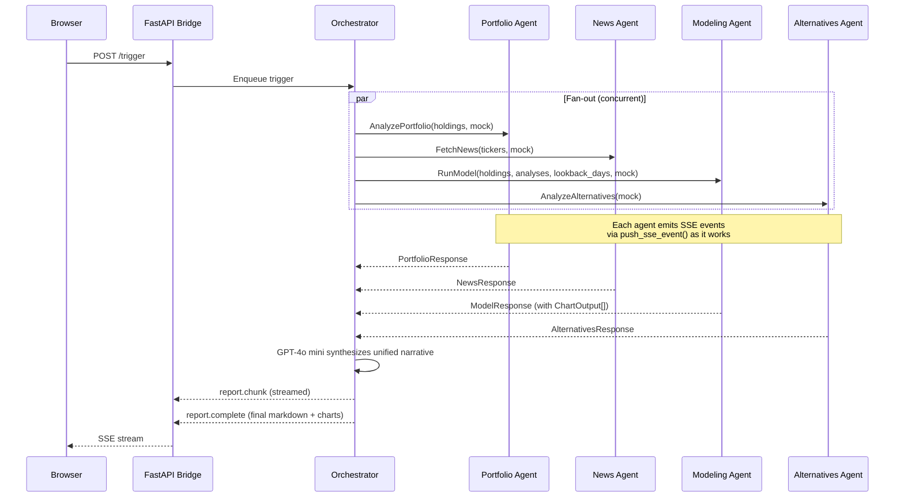

# InvestiSwarm -- Full Architecture

## Overview

InvestiSwarm is a multi-agent investment analysis platform. Five specialized uAgents collaborate through a central orchestrator to produce a unified narrative investment report. A FastAPI bridge translates between the browser (HTTP/SSE) and the agent protocol.



---

## Process Model

The system runs in a **single OS process** with two event loops isolated by thread:



**Key detail:** `push_sse_event()` in `agents/bridge/events.py` bridges the two loops via `loop.call_soon_threadsafe()`. This is the only cross-thread communication point. *[Phase 1]*

---

## Data Types

All inter-agent messages are `uagents.Model` (Pydantic). All SSE events are `pydantic.BaseModel`.

### Request Models *[Phase 1 defined / Phase 2 consumed]*

Defined in `agents/models/requests.py`. Sent **Orchestrator --> Domain Agent**.



| Model | Target Agent | Key Fields | Notes |
|-------|-------------|------------|-------|
| `AnalyzePortfolio` | Portfolio `:8001` | `holdings` (ticker list) | Mock flag bypasses API calls |
| `FetchNews` | News `:8002` | `tickers` (ticker list) | |
| `RunModel` | Modeling `:8003` | `holdings`, `analyses`, `lookback_days` | `analyses` selects from chart registry |
| `AnalyzeAlternatives` | Alternatives `:8004` | (none beyond mock) | Fetches crypto + commodities |

---

### Response Models *[Phase 1 defined / Phase 2 consumed]*

Defined in `agents/models/responses.py`. Sent **Domain Agent --> Orchestrator**.



#### Field Reference

**PortfolioResponse**
| Field | Type | Example |
|-------|------|---------|
| `sector_allocation` | `dict[str, float]` | `{"Technology": 0.42, "Healthcare": 0.18}` |
| `top_holdings` | `list[dict]` | `[{"ticker": "AAPL", "weight": 0.18, "sector": "Technology"}]` |
| `herfindahl_index` | `float` | `0.087` (lower = more diversified) |
| `portfolio_beta` | `float` | `1.12` |

**NewsResponse**
| Field | Type | Example |
|-------|------|---------|
| `headlines` | `list[dict]` | `[{"title": "...", "sentiment": 0.82, "ticker": "AAPL"}]` |
| `aggregate_sentiment` | `dict[str, float]` | `{"AAPL": 0.82, "MSFT": -0.35}` -- range [-1, 1] |
| `overall_sentiment` | `float` | `0.29` |

**ModelResponse**
| Field | Type | Example |
|-------|------|---------|
| `holdings_analyzed` | `list[str]` | `["AAPL", "MSFT", "NVDA"]` |
| `sharpe_ratio` | `float` | `1.34` |
| `volatility` | `float` | `0.187` (annualized) |
| `trend_slope` | `float` | `0.0023` (regression coefficient) |
| `charts` | `list[ChartOutput]` | One per analysis type |
| `metrics` | `dict[str, float]` | Known keys: `r_squared`, `max_drawdown`, `beta` |

**ChartOutput** (embedded in `ModelResponse.charts`)
| Field | Type | Example |
|-------|------|---------|
| `chart_type` | `str` | `"regression"` |
| `title` | `str` | `"Portfolio Linear Regression (1Y)"` |
| `image_base64` | `str` | Base64-encoded PNG |
| `summary` | `str` | One-line description for narrative weaving |

**AlternativesResponse**
| Field | Type | Example |
|-------|------|---------|
| `crypto_prices` | `dict[str, float]` | `{"BTC": 67450.0, "ETH": 3520.0}` |
| `cross_correlations` | `dict[str, float]` | `{"BTC": 0.12, "GOLD": -0.05}` |

---

### SSE Event Models *[Phase 1]*

Defined in `agents/models/events.py`. Sent **Agent Layer --> Browser** via FastAPI SSE.



Every SSE event is an `SSEEvent` envelope. The `event_type` discriminates the `payload` shape:

| `event_type` | Payload Model | Used By | Phase |
|---|---|---|---|
| `agent.status` | `AgentStatusPayload` | All agents -- lifecycle transitions | 1 (stubs), 2+ (real) |
| `agent.thought` | `AgentThoughtPayload` | All agents -- reasoning steps | 1 (stubs), 2+ (real) |
| `agent.message` | `AgentMessagePayload` | Inter-agent comms visualization | 3 (graph edges) |
| `report.chunk` | `ReportChunkPayload` | Orchestrator -- streaming report | 2 |
| `report.complete` | `ReportCompletePayload` | Orchestrator -- final report | 2 |
| `chat.response` | `ChatResponsePayload` | Orchestrator -- chat replies | 4 |

---

## End-to-End Message Flow *[Phase 2]*



---

## Module Map

```
agents/
  main.py                     Entry point -- uvicorn + Bureau startup       [Phase 1]
  bureau.py                   Bureau launcher (daemon thread)               [Phase 1]
  orchestrator.py             Orchestrator agent (stub -> LLM dispatch)     [Phase 1 stub / Phase 2 real]
  portfolio_agent.py          Portfolio analysis agent                      [Phase 1 stub / Phase 2 real]
  news_agent.py               News + sentiment agent                        [Phase 1 stub / Phase 2 real]
  modeling_agent.py           Quantitative modeling agent (no LLM)          [Phase 1 stub / Phase 2 real]
  alternatives_agent.py       Crypto/commodities agent                      [Phase 1 stub / Phase 2 real]
  models/
    requests.py               Request models (Orchestrator -> Agents)       [Phase 1]
    responses.py              Response models (Agents -> Orchestrator)      [Phase 1]
    events.py                 SSE event envelope + payloads                 [Phase 1]
  bridge/
    app.py                    FastAPI app, /events SSE, /trigger POST       [Phase 1]
    events.py                 push_sse_event() cross-thread bridge          [Phase 1]
  mocks/
    portfolio.py              Mock PortfolioResponse                        [Phase 1]
    news.py                   Mock NewsResponse                             [Phase 1]
    modeling.py               Mock ModelResponse + ChartOutput              [Phase 1]
    alternatives.py           Mock AlternativesResponse                     [Phase 1]
  tests/
    test_models.py            Model serialization round-trips               [Phase 1]
    test_bureau.py            Agent registration + address stability        [Phase 1]
    test_bridge.py            SSE, CORS, PNA headers, event delivery        [Phase 1]
    test_mock.py              Mock data structure validation                [Phase 1]
```

**Frontend** *(Phase 3+, not yet scaffolded)*
```
src/                          React/Vite app                                [Phase 3]
  - Agent graph (React Flow)  Node-per-agent with streaming thoughts       [Phase 3]
  - Report viewer             Markdown + inline base64 charts              [Phase 3]
  - Chat interface            Text input routed through orchestrator        [Phase 4]
```

---

## Phase Roadmap Summary

| Phase | Name | Goal | Status |
|-------|------|------|--------|
| **1** | Foundation | Scaffold, models, bridge, mock data, Bureau -- verified E2E by curl | In Progress (2/3 plans done) |
| **2** | Agent Pipeline | Real agent logic produces complete markdown report via curl (no frontend) | Not Started |
| **3** | Frontend + Visualization | React app with live agent graph, streaming thoughts, report rendering | Not Started |
| **4** | Chat + Demo Polish | Follow-up chat, graph animation, clean demo flow | Not Started |

---

## Configuration

| Variable | Default | Purpose | Phase |
|----------|---------|---------|-------|
| `MOCK_DATA` | `"true"` | Enables mock data mode for all agents | 1 |
| Finnhub API key | -- | Financial news + commodity data (60 req/min) | 2 |
| CoinGecko API | -- | Crypto prices (30 req/min, no key needed) | 2 |
| OpenAI API key | -- | GPT-4o mini for orchestrator narrative synthesis | 2 |

---

## Key Design Decisions

- **Single process, two threads** -- Bureau and FastAPI share a process but have isolated event loops, bridged by `call_soon_threadsafe` *[Phase 1]*
- **Bureau on port 8006** -- avoids ASGI conflict with uvicorn on 8000 *[Phase 1]*
- **Mock-first development** -- every agent has a mock path to preserve API rate limits *[Phase 1]*
- **Curl-verifiable before React** -- Phase 2 must produce a complete report with no frontend *[Phase 2]*
- **GPT-4o mini for orchestrator** -- cost efficiency at hackathon scale *[Phase 2]*
- **Unified narrative, not sectioned** -- orchestrator synthesizes thematic report, not agent-per-section *[Phase 2]*
- **SSE (not WebSocket)** -- simpler unidirectional streaming from server to browser *[Phase 1]*
- **No backwards compatibility concerns** -- single-dev unreleased app
